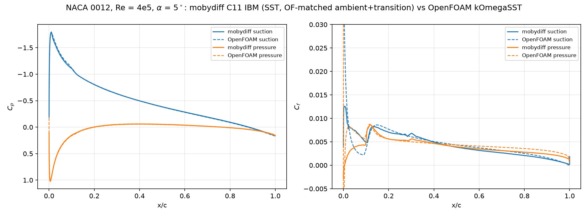
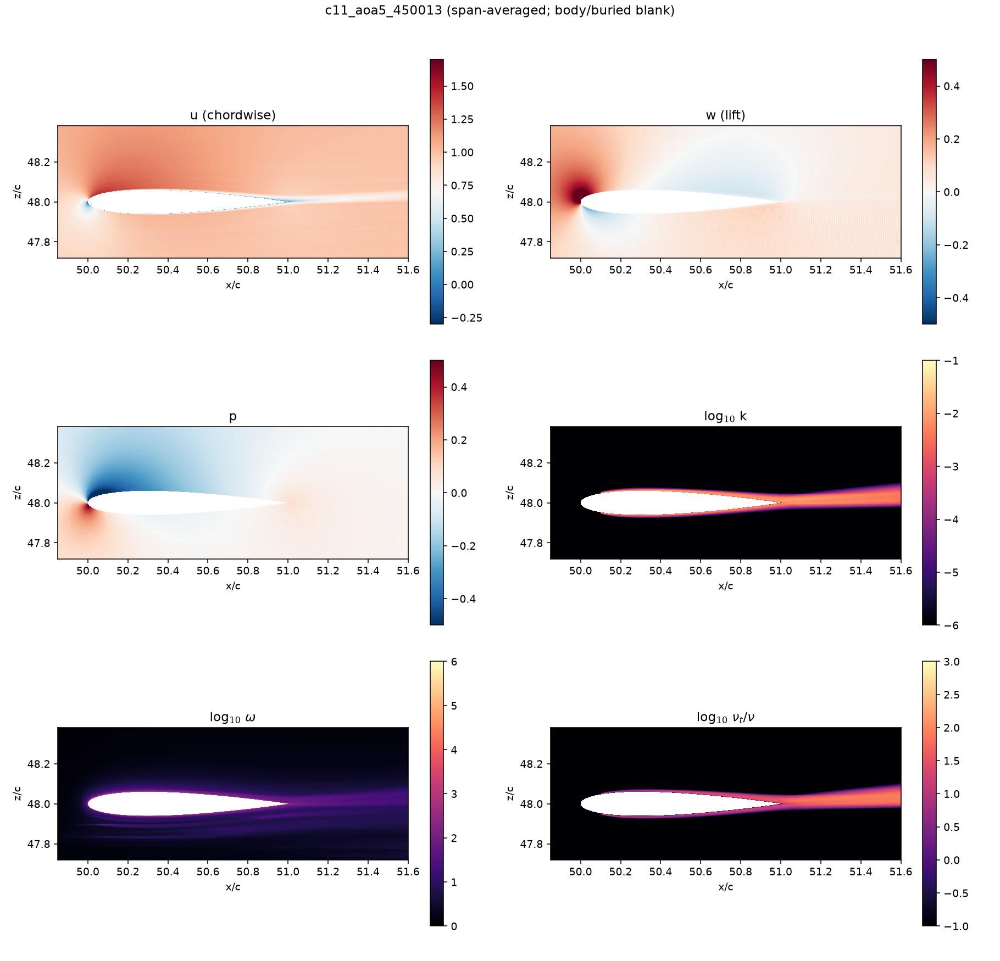
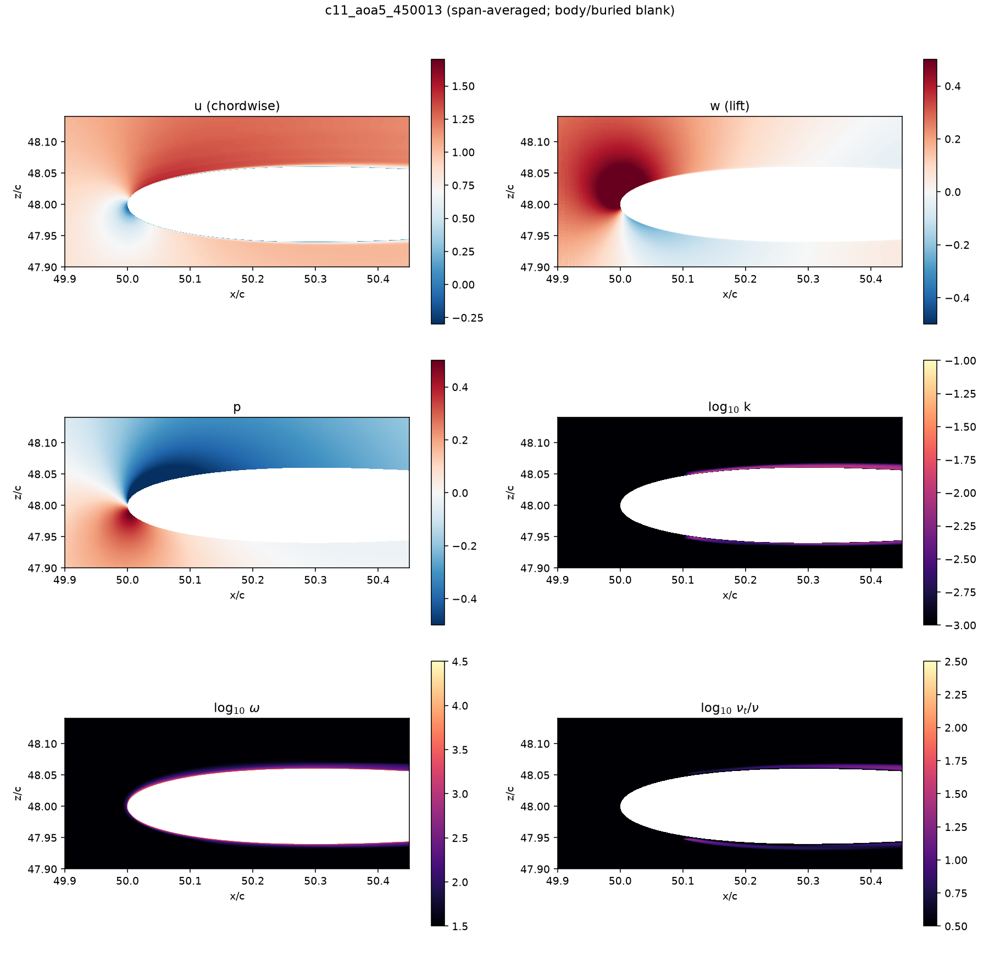

# NACA 0012 RANS validation — alpha = 5 deg, Re_c = 4e5, vs OpenFOAM

Steady k-omega SST flow over a NACA 0012 at 5 degrees incidence and
chord Reynolds number 4e5, computed with mobydiff's volume-penalization
IBM on a 2:1-refined block grid, and validated against a body-fitted
OpenFOAM (simpleFoam, kOmegaSST) reference. Every modelling choice that
matters is MATCHED between the codes:

- identical closed-TE NACA 0012 geometry (their NACA0012.obj agrees
  with our analytic section to 7e-8);
- identical SST coefficients (their run's printed dict, incl. the
  c1 = 10 production limiter and the nut clip; see
  assets/openfoam/RAS_coefficients_as_run.txt);
- ambient turbulence WITHOUT sustain (their decayControl false), inlet
  k/omega = their inlet pair (tu 21.35 %, nut_in = 1.09 nu);
- forced transition reproducing their fvOptions: k pinned to zero for
  x < LE + 0.09c and volumetric k trip strips at x/c 0.10-0.12 on both
  surfaces ([rans] kpin_box / ktrip_box in c11_aoa5.ini);
- skew-symmetric momentum convection (mobydiff's production form).

Grid: 128c x 96c domain, nose at (50, 48), span y (0.1875c, ny 8),
xz-quadtree refinement, 11 levels, finest c/6144 (first-cell y+
1.4-2.1), 16042 leaves / 8.2M cells. dt = 5e-5, projection niter 18
(Chebyshev-Jacobi).

## Results (converged, stationary over the final time unit)

|          | mobydiff (IBM) | OpenFOAM (body-fitted) |
|----------|----------------|------------------------|
| C_L      | 0.514 +- 0.009 | 0.5142                 |
| C_D      | 0.0130 +- 0.0007 | 0.0134               |
| Cp_min   | -1.796         | -1.780                 |

The Cp distributions overlay within extraction accuracy on both sides
including the suction peak; the Cf comparison shows the same forced
laminar zone and trip on both codes. Known, understood residuals: the
laminar-zone Cf runs 1.5-1.7x the smooth-wall (Thwaites) level — the
staircase wall acts rough at step height ~15 % of the laminar BL
thickness (first-order IBM signature) — and the transition completes
somewhat downstream of OpenFOAM's (first-order upwind smears the k
front).

## Running the case

    ./run_case.sh restart    # continue from a shipped/produced converged
                             # state - the quick verification path
    ./run_case.sh scratch    # full reproduction: staged L10 -> L11
                             # protocol (~10-14 h on one modern GPU)
    ./run_case.sh post       # extract forces/Cp/Cf + the OpenFOAM overlay

The from-scratch protocol runs the whole transient on a 2x-coarser
wall band (L10, dt 1e-4, ~5x cheaper), interpolates onto the L11
layout (interp_restart.py) and finishes at full resolution. Extend
stage 2 if C_L (printed by cv_forces.py) still drifts. L10 alone
reproduces LIFT and Cp within 1-2 % of OpenFOAM at ~5x lower cost, but
overpredicts drag by ~18 % (resolved-wall y+ penalty) — use full L11
whenever C_D matters.

Post-processing notes: cv_forces.py computes flux-exact control-volume
forces in wind axes (--aoa); surface_cp_cf.py extracts Cp (linear wall
extrapolation, converged depth 12 cells) and Cf (k-gated hybrid:
anchored fit in turbulent zones, free-intercept in laminar zones where
the staircase shifts the effective wall); pressure-based quantities
should be read from regular-cadence snapshots (a dt-clipped final
micro-step inflates the stored incremental pn scale).

## assets/

- assets/openfoam/dictionaries/ — the OpenFOAM case's dictionaries
  (fvOptions with the transition constraints, globalVariables,
  turbulence/transport properties, fvSchemes/fvSolution, controlDict,
  topoSetDict, blockMeshDict, 0.orig fields) sufficient to reproduce
  their reference run.
- assets/openfoam/postProcessing/ — their converged surface sampling
  (p, wallShearStress, yPlus; iteration 1479) and force coefficients:
  the data compare_openfoam.py reads (its default path).
- assets/openfoam/NACA0012.obj — their exact geometry.
- xfoil_re4e5_n{1,9}.dat — XFOIL polars (Ncrit 9 and Ncrit 1) for
  context. (The Debian xfoil build SIGFPEs on any second viscous point
  in a session: run one ALFA per process and parse stdout.)

Full investigation trail (fan/staircase analysis, the skew-convection
migration, resolution and ambient studies, BoostConv caveats):
docs/next_session_naca_re4e5.md, docs/next_session_skew_convection.md,
docs/next_session_boostconv.md.
